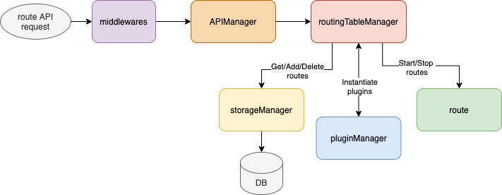
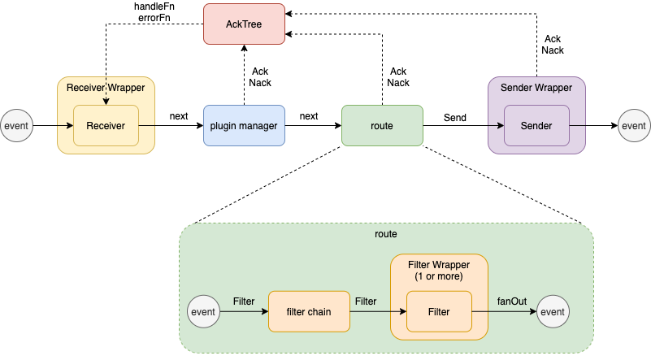

# EARS Architecture
The two major pieces of EARS are:
* Routes management: users can get/create/update/delete routes through the EARS APIs.
* Route event processing: once a route is created and running, events will flow through the route and be processed (filtered, transformed, etc)

This document shows the architectures of the two pieces.

## Route Management

### Middlewares
EARS currently expose route management API through REST. An API request will first enter EARS's [middleware layer](../internal/app/middlewares.go). Currently, the middleware sets up logging for the request. In the future, it may also handle request authentication, and setup tracing and metric to the request

### APIManager
A request then goes to the API manager where it is sent to a request handler using [GorillaMux](https://github.com/gorilla/mux). GorillaMux will determine which handlers to use based on the [request's HTTP method and its URL path](../internal/pkg/app/handlers_v1.go#L39-L47)

A handler will parse the request body and then send it to routingTableManager for further processing.

### RoutingTableManager
Routing table manager get/create/update/delete route(s). Because route creation is the most complex, we will focus on route creation for the rest of this section.

The routing table manager creates a route as following:
1. validate the route configuration.
2. persist the route in storageManager.
3. instantiate route plugins through pluginManager.
4. construct and run the route.
5. trigger propagation of changes to all other EARS instances (if any).

In the future, the routing table manager will also propagate any route changes to other nodes in an EARS cluster.

### StorageManager
Storage manager persist route configuration in a storage. Currently, two are impelemented:
* [In Memory Storage:](../internal/pkg/db/in_memory_route_storer.go) store routes in memory. This is only intended for testing as all routes will be deleted when the app terminates.
* [DyanmoDB Storage:](../internal/pkg/db/dynamo/dynamodb_storer.go) store routes in AWS dynamodb.

### Route
An EARS route consist of a receiver, 0 or more filters, and a sender. The [Route](../pkg/route/route.go) object wires up a receiver, a sender, and filters and starts the running of the route.

## Route event processing

Once a route is created and running, its receiver will produce events (usually through external message ingestion) and send them to the route filters for processing. Filters process (transform, filter, split, etc) events and send them to the route sender. Sender then sends out the event.

### Receiver
Receiver is an event producer. It usually receives messages from external sources (Kafka, SQS, webhook, etc), and then packages messages into events for EARS internal consumption.

Receiver should create a context for every event. It calls the provided [next function](../pkg/receiver/types.go#L50) to pass down an event. In current  implementation, the next function is the [next in plugin manager](../internal/pkg/plugin/manager.go#L196)

### Plugin Manager
The next function inside [plugin manager](../internal/pkg/plugin/manager.go) receives events from a receiver. Because a receiver can be in multiple routes, the plugin manager will look up all routes associated with the receiver. For each route, a new event is cloned from the original event, and a goroutine is created to minimize cross talks between routes sharing the same 
receiver.

The plugin manager calls the [next function in route](../pkg/route/route.go#L52) to pass down an event.

### Route
The [route](../pkg/route/route.go) links up 1 or more filters using a [filter chain](../pkg/filter/chain.go). It calls the [Filter function](../pkg/filter/chain.go#L50) in filter chain.

Filter chain iterates through each filter by calling each filter's [Filter function](../pkg/filter/types.go#L59) with an event. A filter processes the event inside the Filter function before returning 0 or more processed event back to the filter chain.

After filter chain goes through its filters, the resulting event(s) are [fanOUt](../pkg/route/route.go#L76) to the sender in parallel by calling sender's [Send function](../pkg/sender/types.go#L43)

### Sender
Sender receives events from [Send function](../pkg/sender/types.go#L43) and then sends them out to downstream services (Kafka, SQS, webhook, etc)

### Event acknowledgement and error handling
One thing to note is that the signatures of event processing functions including a [next function](../pkg/receiver/types.go#L50), a [Filter function](../pkg/filter/types.go#L59), and a [Send function](../pkg/sender/types.go#L43) do not return errors. What happen when there is an error when processing an event, and how do we relay the error back to the receiver where an event originates from?

Each event has a [Ack method](../pkg/event/types.go#L45) and a [Nack method](../pkg/event/types.go#L49). When an event is finished processed, its
[Ack](../pkg/event/types.go#L45) should be called. When an error occurs when processing an event, its [Nack](../pkg/event/types.go#L49) should be called.

Receivers can listen to event acknowledgement and errors with the [WithAck option](../pkg/event/event.go#L62) when it creates an event.

