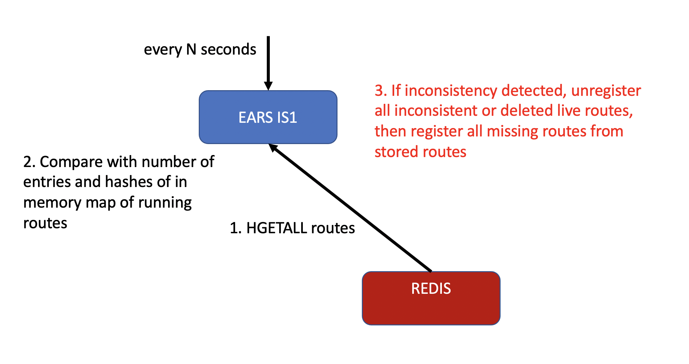
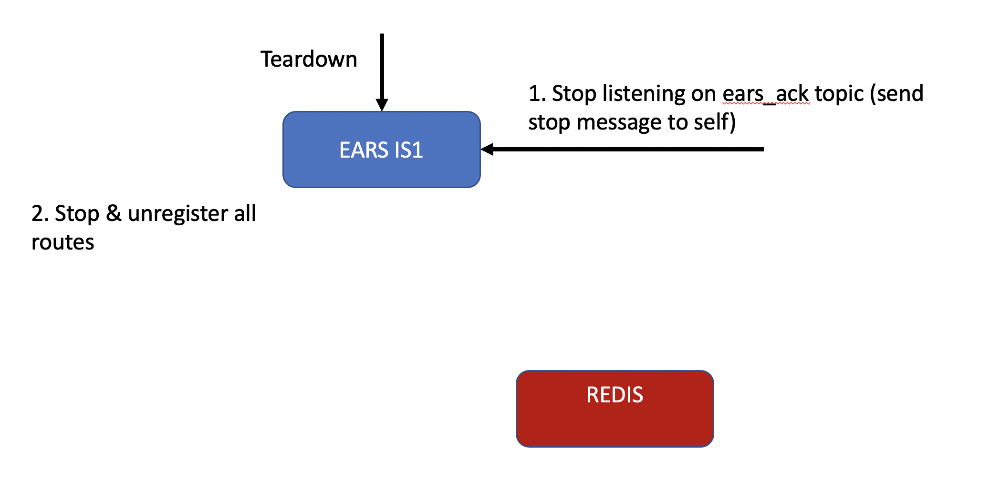
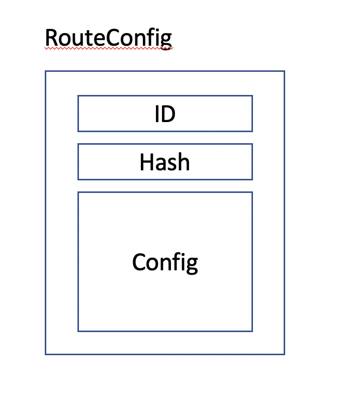
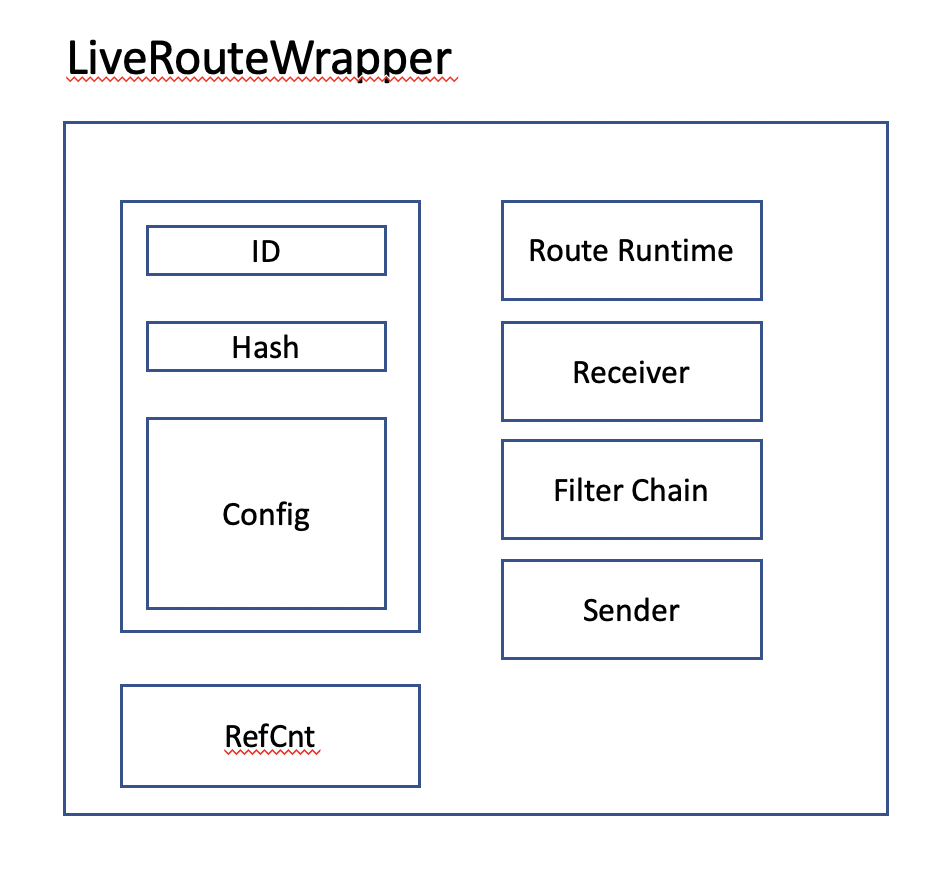

# Routing Table Synchronization

A key aspect of horizontal scalability of the EARS service is its ability to synchronize the 
routing table across all EARS instances in a cluster. All instances are read-write instances   
able to perform CRUD operations on the routing table. All EARS instances share a central
persistence storage as their source of truth. In addition each instance holds its own local copy 
of the routing table which must be constantly synchronized with the persisted version of the
table.

## Architecture

There are four main concerns:

* startup
* shutdown
* delta synchronization
* periodic synchronization

On startup, RoutingTableManager (RTM) will load, register and run all routes from the storage layer.
RTM manages several in-memory data structures to keep track of all known route configurations and 
their runtime information.

RTM registers itself as an observer of a DeltaPushSyncer (DTM). When another EARS instance modifies 
the shared routing table, the RTM receives a delta event from the DTM. A delta event contains a 
route ID and an operation code (add or remove) as payload. If a new route has been added, RTM will 
load the route from the storage layer by ID and register and run it. If an existing route has been
removed, RTM will stop and unregister the route.

Despite best efforts, over time the in-memory routing table managed by the RTM may become inconsistent
with the routing table persisted in the storage layer (source of truth). Therefore, RTM will check 
periodically, if there is any drift between the persisted version of the routing table and the 
RTM's in-memory version. If any inconsistencies are detected, RTM will repair those accordingly.

On shutdown, RTM will stop and unregister all routes.

## Delta Sync

Currently we have a Redis pub-sub based implementation of the delta syncer interface and also an
in-memory implementation to be used as a mock-implementation for unit tests. The documentation here
will focus on the Redis implementation.

The Redis implementation utilizes two Redis topics, _ears_sync_ and _ears_ack_. All EARS instances 
in a cluster subscribe to the _ears_sync_ topic to learn about routing table changes performed by
other EARS instances. By contrast, if an ERAS instance is actively processing a CRUD operation, it 
will publish an event on the _ears_sync_ channel to notify all other instances.

Delta event consist of comma separated operation code, rules id, instance id and a unique session id.
The session id is necessary to allow for concurrent CRUD operation originating from the same EARS
instance.

1. An EARS Instance (IS1) receives an AddRoute() API call
1. IS1 stores the new route config in the shared persistence layer, here also Redis: `HSET routes rid config` 
1. IS1 publishes a delta event on _ears_sybc_: `PUBLISH ears_sync add,rid,iid,sid`
1. IS1 register and runs the route
1. Meanwhile, IS2 receives the delta event and makes sure the instance ID in the event is not idenitical 
   with hits own instance ID
1. IS2 then loads the route config from the persistence layer
1. IS2 now also register and runs the route
1. IS2 sends an ack message back through the _ears_ack_ channel using its own instance ID and teh same
   session ID: `PUBLISH ears_sync add,rid,iid,sid`
1. Once IS1 has collected acks from all other instances for the current session ID it can be sure the 
   new route information has been fully propagated
   
Note that the acking currently serves no real purpose, but we may choose to make use of it in the future.
Currently, the publishing of delta events follows a fire and forget strategy and relies on the periodic
syncing process for repairs of any inconsistencies. For that reason the operation of publishing and collecting 
acks does _not_ have to be implemented as a blocking operation which simplifies testing.

## Periodic Sync

The Routing Table Manager (RTM) will check periodically, if there is any drift between the persisted version 
of the routing table and the RTM's in-memory version. If any inconsistencies are detected, these need to 
be repaired.

1. Every five minutes, the RTM will load the entire routing table from the persistence layer
1. The RTM will then iterate over all the running routes it holds in memory
1. If the RTM finds any running routes that don't have a counterpart with the same ID in 
   the persistence layer, it will stop and unregister those routes
1. If the RTM finds any running routes that do have a counterpart with the same ID in
   the persistence layer but a different configuration hash, it will also stop and unregister those routes
1. RTM will then iterate over all the routes it loaded from the persistence layer earlier; if it finds any
   routes that are not present in the RTM in-memory table, then those missing routes will be registered
   and run

## Startup

On startup the Routing Table Manager (RTM) will load all route configurations from the persistence layer
and register and run those. This process initializes all routes in the RTM's in memory routing table.

## Shutdown

On shutdown the Routing Table Manager (RTM) will iterate over all the live routes in its in-memory routing
table and will stop and unregister all of them.

## Data Structures

The RouteConfig combines a route ID, a route configuration and a route hash. The hash is an MD5 hash over
the entire configuration excluding the route ID. Note that the route ID can be chosen by the caller of the
AddRoute() API. If the caller omits the route ID the RTM will choose the route hash as the route ID. This means
a route ID can be identical with the route hash but it doesn't have to be.

The RTM's in-memory routing table needs to store more information in addition to the RouteConfig it exchanges
with the persistence layer. This data structure is the LiveRouteWrapper (LRW).

* reference to the running route (for running and stopping the route)
* reference to receiver plugin (for registering and unregistering) 
* reference to sender plugin
* reference to filter chain
* reference counter (to count how many routes / route IDs sahre the same route hash)

The RTM's in-memory routing table consists of two hash maps, one maps route config hashes to LRWs,
the other maps route IDs to LRWs. As long as all hashes and IDs are unique the two maps are somewhat 
redundant.

A more interesting case arises when we have to deal with multiple route IDs that all share the same hash
and are therefore all pointing to the same LRW. This is where the reference counter comes into play to
keep track of how many route IDs are sharing the same route.

I the wild we will probably encounter a mix of both cases described above such that some routes are shared 
and others are unique.

Take note of that fact that live route sharing and live route reference counting is a layer above and separate from
plugin sharing and plugin reference counting. For example three unique live routes with reference count 1 that
all share the same sender plugin with reference count 3.

## Use Cases: Adding Routes, Updating Routes, Deleting Routes

By carefully utilizing the Hash-to-LRW and the ID-to-LRW hash maps we can support user defined route IDs
with idempotency and resource sharing!

Remove Route:

* ID does not exist -> idempotent, do nothing
* ID exists -> decrement refCnt, if refCnt == 0 delete route

Add Route:

* ID does not exist, hash does not exist -> add new route
* ID exists, hash identical -> idempotent, do nothing
* ID exists, hash different -> update existing route(s) (see below)
* ID does not exist, same hash under different ID -> increment reference counter

Update Route:

* Decrement RefCnt on original live route, if RefCnt==0, then delete route
* If new hash does not exist, create new route with RefCnt 1
* If new hash already exists, then increment RefCnt on that route

## Design Considerations

`Map[RouteId]*LRW` may get very large. For example, if many home automations subscribe to the same type of event 
but all choose different (random?) route IDs. Choosing identical (deterministic) IDs would cause other problems
because then our reference counting would not be accurate.

If we give up on idempotency, we could enforce the use of hashes as route IDs. Therefore, we would not 
need `Map[RouteId]*LRW`.

If we give up on managing routes via _DeployFlow()_ / _UndeployFlow()_, but rather use a dedicated UI to 
add and remove routes as needed, then `Map[RouteId]*LRW` may not grow large. If we want to avoid having to 
build and manage a new UI, we may also choose to use a dedicated flow to manage all EARS subscriptions for 
a given app.

Instead of managing the reference counting in EARS, we could also place the burden on Gears to manage 
the mapping from flows ID to route IDs using a helper service with a mapping database. This is probably a 
bad idea. Adding yet another layer of middleware doesn't simplify anything and we believe reference counting
should be one of thhe competencies of the EARS service.

To help manage large data structures, use IDs shorter than UUIDs that are unique enough.

If we do allow many identical routes that only differ in their ID we should optimize the persistence layer 
to avoid redundant storage of identical route configs.
