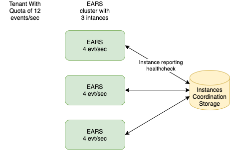
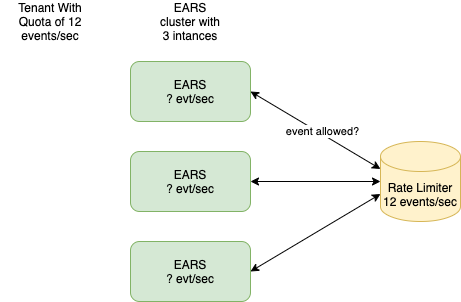
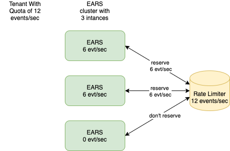

# Tenant Quota and Rate Limiting

Each [tenant](multitenancy.md) in EARS is assigned a quota in numbers of [events](Events.md) per second. The quota limits how rate of event ingestion for a tenant.  

* The quota is an event receiving limit. It is possible for a tenant with a quota of 10 evt/s to receive at 10 evt/s but to send out at 20 evt/s due to event splitting or fanout. (Do we want a separate quota for sending? POST MVP)
* The tenant quota is distributed across all instances in a EARS cluster. For example, if a tenant's quota is 12 evt/s, and there are 3 instances in a cluster, it could be that the quota is distributed as 4, 4, 4 evt/s across the 3 instances. Please note that although EARS will try its best to evenly distributed the quota across instances, there will be cases where this is not possible. For example, if we have a 100 instance EARS cluster receiving events from a kafka topic with 10 partitions, then only 10 instances will have a none-zero quota assigned to them.
* The quota is not a hard limit. It is possible for a tenant to temporarily exceed its quota in certain conditions (for example, in very bursting traffics). The average rate in the long run should never exceed the quota limit.

### Implication on the Receiver

Rate limiting are enforced when a receiver calls its [next function](../pkg/receiver/types.go#L50) with an event. The next function will block until either the event passes through the rate limiter or when the event context is cancelled. 

This also means that the events at the receiver side may pile up if a receiver is ingesting at a rate over the limit. It is up to the receiver to decide how they want to handle the pile up events (discard, prioritize, etc)

## Distributed Rate Limiting

### Dividing up quota among instances
One simple solution is to divide up the quota by the number of EARS instances, and each instance is only allowed to handle its share of quota. For example, given a tenant quota of 12 evt/s and 3 instances, then each instance is allowed to handle 4 evts/s for the tenant locally.

Locally, some common rate limiting strategies are token bucket or sliding window.

Instances use a common coordinator to report their health and to figure out the number of instances in a cluster

Pro:
* Simple

Con:
* Does not handle unbalance traffic (for example, a kafka topic with partition not aligning to the number of EARS instances)

### Centralized rate limit storage
Another common solution is to implement a centralized rate limit service using a shared storage like redis. Every EARS instance checks with the rate limit storage on every event to make sure it does not exceed the allowed quota

Pro:
* Simple
* Can handle unbalance traffic

Con:
* Hard to scale horizontally
* What happen when the service goes down?

### A Hybrid Approach - Adaptive Rate Limiter

Pro:
* Can handle unbalance traffic
* Can scale up easily
* Can fall back to current quota if central storage goes down

Con:
* Added complexity

Manual update per-instance quota?